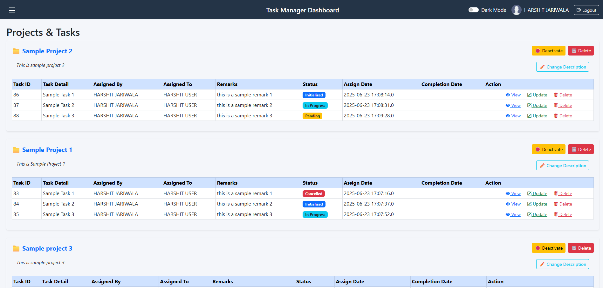
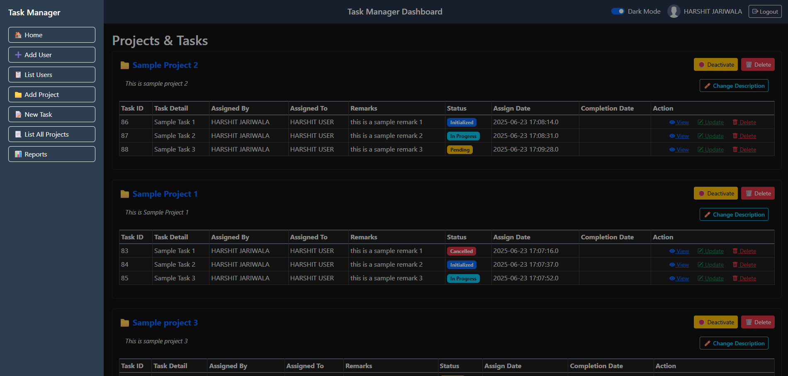
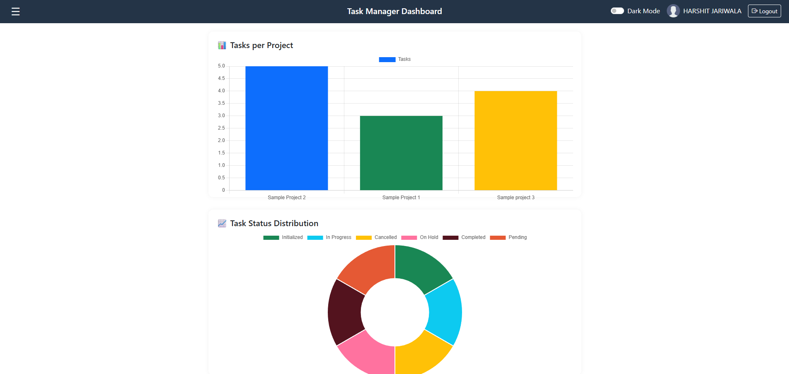

# 📋 Project Management Tool

A robust web-based Project & Task Management System built using JSP, Servlets, and Oracle SQL. Designed for teams to track projects and manage tasks efficiently with a clean, responsive UI and visual reports.

## ✨ Features

* **🔐 Role-Based Access**:

  * **Admin**: Add/view/update/delete users, projects, and tasks. Assign tasks to users.
  * **User**: View assigned tasks, update task status.

* **📊 Reports Dashboard**:
  View visual insights with **Chart.js** for task distribution, completion status, and project load.

* **🌓 Light/Dark Mode**:
  Toggle theme support and responsive layout using **Bootstrap 5**.

---

## 🛠️ Tech Stack

| Layer    | Technology                          |
| -------- | ----------------------------------- |
| Frontend | JSP, HTML, CSS, Bootstrap, Chart.js |
| Backend  | Java Servlets, JSP, JDBC            |
| Database | Oracle SQL                          |
| Server   | Apache Tomcat (v9+)                 |
| IDE      | Eclipse IDE                         |

---

## 🚀 Setup Instructions

### 1. Clone the Repository

```bash
git clone https://github.com/harshitjariwala/ProjectManagement.git
cd ProjectManagement
```

### 2. Database Setup (Oracle SQL)

* Create a database schema named `projectdb` (or your preferred name).
* Run the SQL script (if provided) to create the required tables: `users`, `projects`, `tasks`.

Example schema snippet:

```sql
CREATE TABLE users (
    id NUMBER PRIMARY KEY,
    first_name VARCHAR2(50),
    last_name VARCHAR2(50),
    email VARCHAR2(100),
    password VARCHAR2(100),
    role VARCHAR2(20)
);
```

* Update your JDBC connection settings in the `DBConnection.java` file:

```java
String url = "jdbc:oracle:thin:@localhost:1521:xe";
String username = "your_db_username";
String password = "your_db_password";
```

### 3. Import Project in Eclipse

* Open **Eclipse IDE**
* File → Import → **Existing Projects into Workspace**
* Choose the cloned project folder and finish importing.

### 4. Configure Tomcat

* Add **Apache Tomcat** to your Eclipse runtime environments.
* Right-click the project → **Run on Server**.

---

## 📸 Demo Screenshots

| Admin Dashboard                           | Dark Mode                          | Reports View                       |
| ----------------------------------------- | ---------------------------------- | ---------------------------------- |
|  |  |  |

> 📌 *Screenshots are located inside the `screenshots/` folder. You can update these with your own UI.*

---

## 🤝 Contributing

Feel free to fork this repository and open a pull request for feature improvements, bug fixes, or enhancements.

---

## 📧 Contact

**Harshit Jariwala**
📧 [harshitjariwala14@gmail.com](mailto:harshitjariwala14@gmail.com)
🔗 [LinkedIn](https://www.linkedin.com/in/harshitjariwala)

---

Let me know if you'd like me to generate the screenshot folder or help you write a sample `DBConnection.java` or SQL schema.

